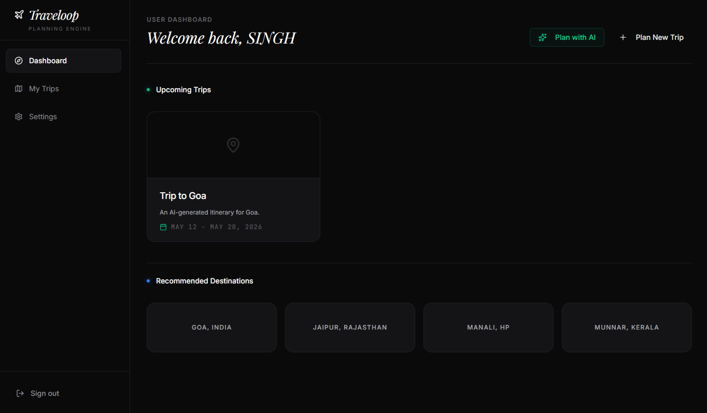
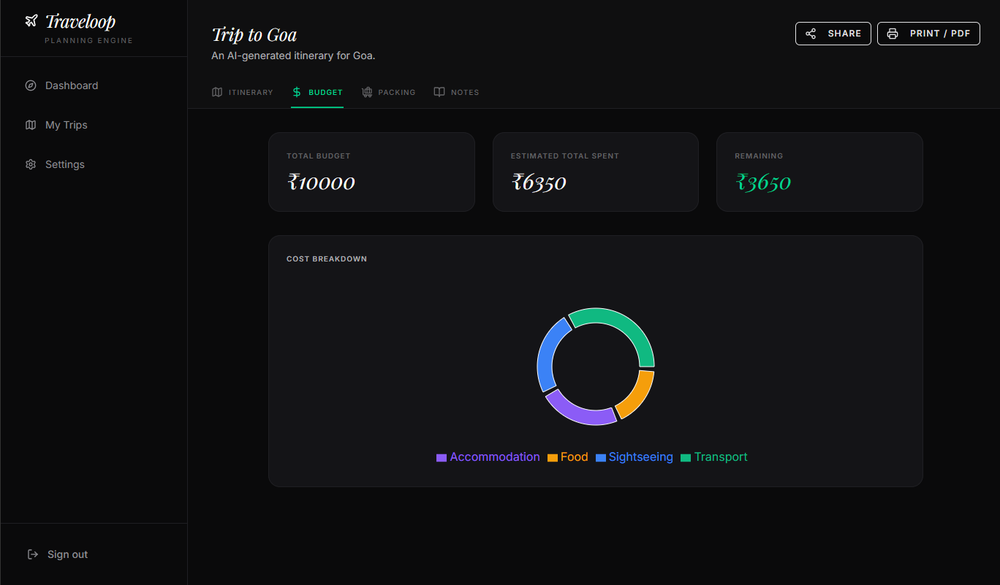
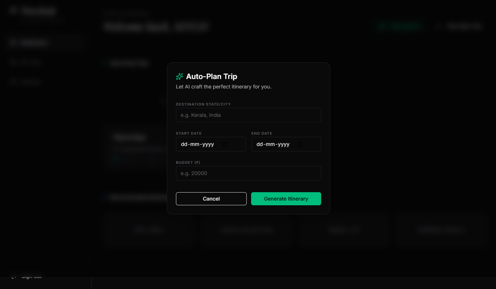
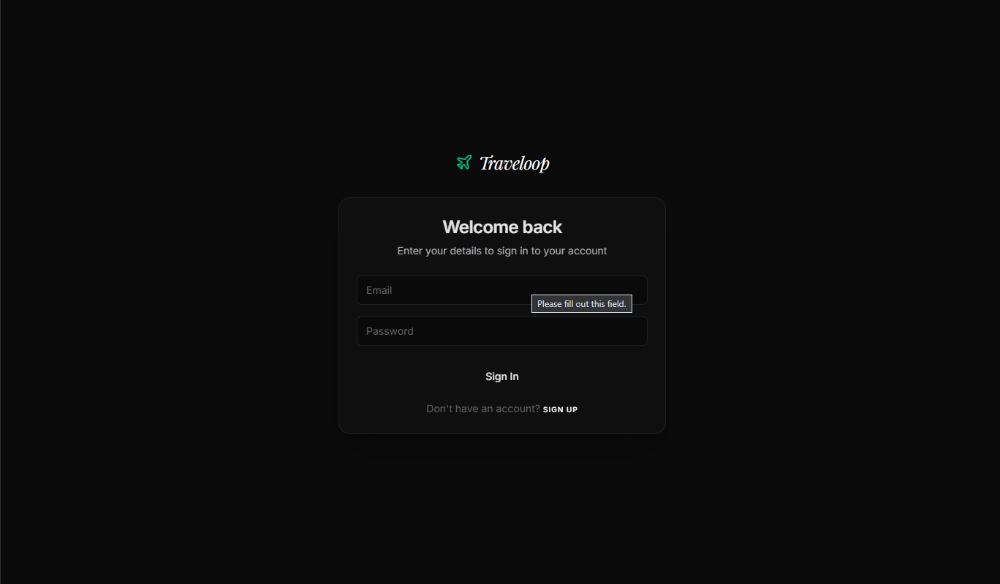
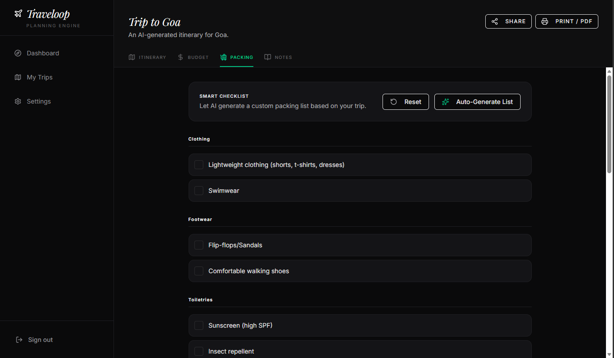

# 🌍 Traveloop - AI-Powered Travel Planning

> Your personal travel companion that transforms trip planning from overwhelming to effortless.

<div align="center">
  
  
  
</div>

## 📖 About

Traveloop is a comprehensive travel planning application built for modern travelers. Plan multi-city trips, manage budgets, organize activities, and keep everything in one beautiful, intuitive interface—powered by AI.

**Built for:** [Hackathon Name]  
**Timeline:** [Duration]

## ✨ Key Features

### 🗺️ Smart Trip Planning
- **Multi-City Itineraries** - Plan complex trips with multiple destinations
- **AI-Powered Suggestions** - Get personalized city and activity recommendations via Gemini AI
- **Day-by-Day Planning** - Organize activities with detailed schedules


### 💰 Budget Management
- **Cost Tracking** - Monitor expenses across all trip activities
- **Visual Breakdowns** - Interactive charts showing spending categories
- **Budget Alerts** - Stay within your financial limits



### 📋 Travel Organization
- **Packing Checklists** - Never forget essential items
- **Trip Notes & Journal** - Document memories and important details
- **Dashboard Overview** - See all upcoming trips at a glance

<div align="center">
  
  
  
</div>

## 🛠️ Tech Stack

**Frontend**
- ⚛️ React 19 + Vite
- 🎨 Tailwind CSS
- 🎭 shadcn/ui + Radix UI
- ✨ Framer Motion

**Data & State**
- 📊 Dexie.js (IndexedDB wrapper)
- 🔄 React Router v7
- 📈 Recharts

**AI & APIs**
- 🤖 Google Gemini AI API
- 🔒 TypeScript (100% type-safe)



## 🗄️ Database Architecture

Built with a robust relational model using IndexedDB for offline-first capability:

```
Users → Trips → Stops → Activities
              ↓
            Lists, Notes
```

- **Normalized schema** for efficient queries
- **Client-side relational integrity**
- **Offline-first design**

## 🚀 Getting Started

```bash
# Clone the repository
git clone https://github.com/yourusername/traveloop.git

# Navigate to project
cd traveloop

# Install dependencies
npm install

# Start development server
npm run dev
```

## 📸 Screenshots

<div align="center">
  Proj
  ### Packing Checklist
  
  
</div>

## 🎯 Hackathon Highlights

- ✅ **Innovative Database Design** - Relational data modeling entirely in the browser
- ✅ **AI Integration** - Intelligent travel recommendations using Gemini AI
- ✅ **Premium UX** - Smooth animations and intuitive user flows
- ✅ **Production-Ready** - Clean code architecture with TypeScript
- ✅ **Responsive Design** - Works seamlessly across all devices

## 🔮 Future Enhancements

- [ ] Collaborative trip planning with friends
- [ ] Real-time flight and hotel booking integration
- [ ] Weather forecasts for destinations
- [ ] Social sharing of trip itineraries
- [ ] Mobile app (React Native)

## 👨‍💻 Developer

**Ankit Singh**  
**Hasrh Ghatad**  
**Mariyam Tinwala**  
**Noorsaba Parpotra**  


---

<div align="center">
  
  **Made with ❤️ for travelers, by travelers**
  
  ⭐ Star this repo if you found it helpful!
  
</div>